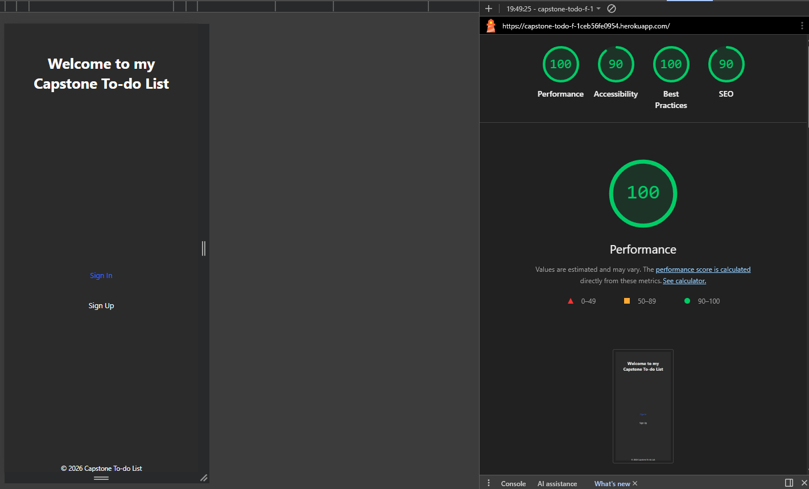
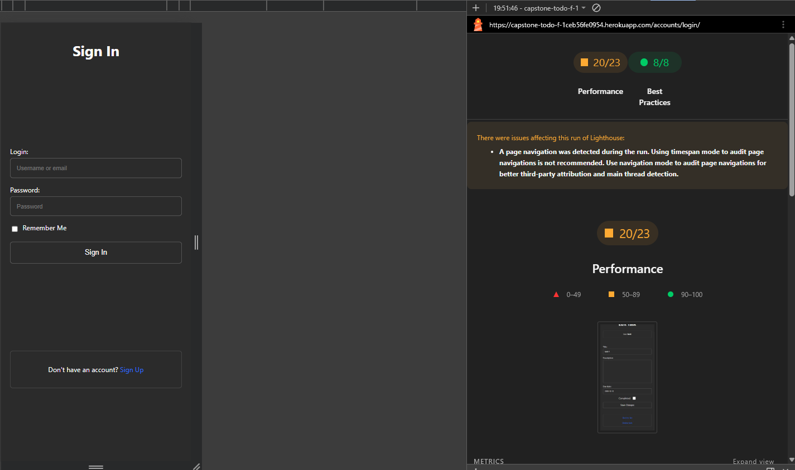
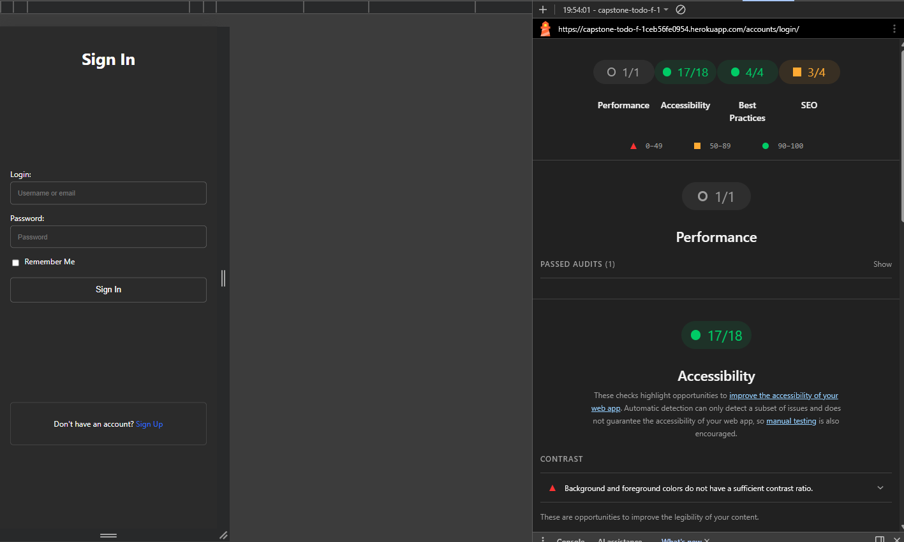

Capstone Project – To-Do List Application

A minimal, mobile-first Full Stack Django to-do list application built in VS Code, using:
  - Django (CBVs)
  - PostgreSQL (production – Heroku)
  - SQLite (local development)
  - django-allauth (authentication)
  - WhiteNoise + Gunicorn
  - Deployed to Heroku

Link to app (ignore security error message): https://capstone-todo-f-1ceb56fe0954.herokuapp.com/

------------------------------------

Live Application

Deployed on Heroku.
Admin panel available at:

`/admin/`

(Admin credentials provided separately.)

Project Overview

- Users can:
  1. Register (username + email + password)
  2. Create lists
  3. Create tasks inside lists
  4. Edit / delete lists and tasks
  5. Mark tasks as completed

The application enforces strict authentication and object-level ownership.

------------------------------

- Agile Planning (LO1)
  - Wireframes
  - GitHub Project (Kanban board)
  - Epics + User Stories created as Issues
  - Structured labels (Epic / Type / Priority)
  - Deployment-first development strategy

This ensured continuous deployment and avoided late-stage configuration issues.

------------------------------------------------------------
## Kanban Project Board (18/19 complete)

Link to project board: https://github.com/users/Shieldsx/projects/7


------------------------------------------------------------
## Wireframes

, , , , , , , , 

----------------------------------------------------

Deployment Architecture

- Production Stack
  - Heroku
  - Gunicorn
  - WhiteNoise
  - Heroku Postgres (essential-0 plan)

Key Production Config

```python
DEBUG = os.environ.get("DEBUG", "False") == "True"

DATABASE_URL = os.environ.get("DATABASE_URL")

if DATABASE_URL:
    DATABASES = {
        "default": dj_database_url.parse(DATABASE_URL, conn_max_age=600)
    }
else:
    DATABASES = {
        "default": {
            "ENGINE": "django.db.backends.sqlite3",
            "NAME": BASE_DIR / "db.sqlite3",
        }
    }
```

Production verified using:


`connection.vendor == "postgresql"`

Security:
- SECRET_KEY stored as environment variable
- Hardcoded secret removed and rotated
- .gitignore excludes:
  - db.sqlite3
  - .venv/
  - env files
  - pycache/

-------------------------------------------

Authentication (Phase 1)

Implemented using django-allauth.
  - Login / Signup / Logout
  - Password change
  - Email update
  - Custom template overrides
  - Secure POST logout
  - Environment-based settings
  - DEBUG=False in production


All authentication routes verified locally and in production.

------------------------------------

Database & Models (Phase 2)
Relational Structure

`User → TodoList → Task`

TodoList Model
  - owner → FK(User)
  - name
  - created_on
  - updated_on


Task Model
  - todo_list → FK(TodoList)
  - title
  - description (optional)
  - completed (Boolean)
  - due_date (optional)
  - created_on
  - updated_on
CASCADE deletion ensures referential integrity.

----------------------------------------------------

Authorisation & Security

Strict object-level ownership enforcement.

Implemented Controls
  - LoginRequiredMixin on all protected views
  - Querysets filtered by owner=request.user
  - Nested task routes:

 `/lists/<list_pk>/tasks/<task_pk>/...`

  - get_object_or_404(..., owner=request.user)
  - 404 masking (prevents ID enumeration)
  - Foreign keys assigned server-side
  - No public data endpoints

Result
Users cannot:
  - Access another user's lists
  - Access another user's tasks
  - Manipulate URLs to retrieve data
  - Reassign ownership via POST tampering

All verified locally and in production.

CRUD Functionality

Fully implemented for:
  - Create List
  - Read List
  - Update List
  - Delete List
  - Create Task (nested)
  - Update Task
  - Delete Task
  - Mark Task Complete
Django messages framework used for UX feedback.

All CRUD tested in:
  - Local SQLite
  - Production Heroku Postgres

------------------------------------------------

UI & UX (Phase 3)

Design goals:
  - Mobile-first
  - No frontend frameworks
  - No JavaScript
  - Minimal CSS
  - Wireframe alignment

Key Refinements
  - Public landing page (redirects authenticated users)
  - Custom dashboard layout
  - Scoped message rendering
  - Custom profile hub (/profile/)
  - Username update (custom view)
  - Allauth template overrides
  - Responsive desktop width constraint:

```CSS
@media (min-width: 768px) {
 .auth,
 .dashboard,
 .landing-container {
   max-width: 480px;
   margin: 0 auto;
 }
}
```

Completed tasks:
  - Appear below active tasks
  - Styled with strikethrough + reduced opacity
  - Remain visible until manually deleted

-----------------------------------
-----------------------------------

Testing

Manual testing completed locally and in production.

Verified:
  - All CRUD operations
  - Redirect for unauthenticated users
  - Cross-user access returns 404
  - Nested route integrity
  - Messages display correctly
  - Postgres in production
  - DEBUG=False confirmed
All tests passed.

### CRUD Manual Tests (Lists + Tasks)

| Feature | Test Case | Steps | Expected Result | Result |
|---|---|---|---|---|
| List | Create list | Login → New List → Enter name → Save | List created, appears in dashboard, success message shown | Pass |
| List | View list detail | From dashboard click list | List detail loads, only that list’s tasks displayed | Pass |
| List | Edit list | Open list → Edit → Save | List updates correctly, success message shown | Pass |
| List | Delete list | Open list → Delete → Confirm | List removed, redirected, URL returns 404 after deletion | Pass |
| Task | Create task (nested) | Open list → Add Task → Fill form → Save | Task created under correct list, success message shown | Pass |
| Task | Edit task | Open list → Edit task → Save | Task updates and persists on refresh | Pass |
| Task | Mark complete | Edit task → Set completed = True → Save | Task marked complete, appears below active tasks | Pass |
| Task | Delete task | Open list → Delete task → Confirm | Task removed, success message shown, URL returns 404 | Pass |
| UX | Message display | Perform create/update/delete | Success message displays once after redirect, no duplicates | Pass |

-----------------------------------------

### Security & Authorisation Manual Tests

| Area | Test Case | Steps | Expected Result | Result |
|---|---|---|---|---|
| Authentication | Protected routes require login | Logout → Visit /lists/ or edit/delete URLs directly | Redirected to login, no data exposed | Pass |
| List Ownership | User B cannot view User A list | User A create list → Copy URL → Login as User B → Paste URL | 404 Not Found | Pass |
| List Ownership | User B cannot delete User A list | Login as User B → Attempt delete URL for User A list | 404 Not Found, list remains intact | Pass |
| Task Ownership | User B cannot edit User A task | Login as User B → Attempt nested task edit URL | 404 Not Found | Pass |
| Task Ownership | User B cannot delete User A task | Login as User B → Attempt nested task delete URL | 404 Not Found | Pass |
| Nested Integrity | Task cannot be accessed under wrong parent list | Use valid task_pk with incorrect list_pk | 404 Not Found | Pass |
| Foreign Key Protection | Task cannot be reassigned via form tampering | Attempt POST manipulation of todo_list field | Task remains bound to owned parent list | Pass |
| ID Enumeration | Direct object guessing | Manually increment list/task IDs in URL | 404 returned, no object existence disclosed | Pass |

---------------------------------------
------------------------------------

## Lighthouse Testing Results (Mobile version)





--------------------------------------------

Admin Panel

Django admin enabled for:
  - Users
  - TodoLists
  - Tasks

Production superuser created after Postgres provisioning.

-------------------------------------

Technologies Used
  - Python
  - Django
  - PostgreSQL
  - SQLite
  - Gunicorn
  - WhiteNoise
  - django-allauth
  - Heroku
  - Git / GitHub
  - VS Code

---------------------------------------------------------

Security Summary
 - Environment-based configuration ✔
 - Postgres in production ✔
 - DEBUG=False ✔
 - SECRET_KEY not committed ✔
 - Object-level ownership enforced ✔
 - 404 masking for unauthorised access ✔
 - No data exposure via URL manipulation ✔

---------------------------------------------------

Development Phases

- Phase 1 – Authentication & deployment
- Phase 2 – Custom models + ownership + CRUD
- Phase 3 – UI polish, testing, README finalisation

------------------------------------------------------

AI Usage Disclosure

AI assistance was used in the following areas:
  - Supporting project planning and structuring the development process to align with early deployment and continuous testing strategy.
  - Providing limited guidance on specific Django configuration and implementation details.
  - Generating initial CSS scaffolding to help match predefined wireframes.

All core architectural decisions, model design, authentication logic, ownership enforcement, testing, and deployment configuration were implemented and validated manually.

-----------------------------------------------------------------------

Production DEBUG Verification (Heroku)

Production configuration was verified to ensure DEBUG=False.

This was confirmed by:

1. Checking Django settings directly in the Heroku environment:

`heroku run python manage.py shell -a capstone-todo-f`

```python
from django.conf import settings
settings.DEBUG
```

Result:

```python
False
```

2. Visiting a non-existent production URL to confirm no debug traceback is exposed.

This verifies that the application is running securely in production mode.

